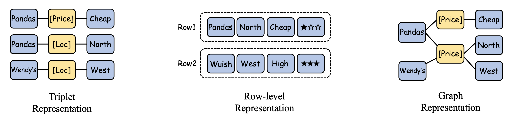

# End-to-end-ToD-Papers

🔥 **Collection of papers, benchmarks and newest trends in the domain of End-to-end ToDs**

🌟 **Any contributions via PRs, issues, emails or other methods are greatly appreciated.**

🔮 **Interactive paperlist&benchmark website is also available on [etods.net](https://etods.net)**

## Intro: What is the End-to-end ToDs (EToDs)?

In contrast to traditional pipelined task-oriented dialogue systems(ToDs), EToDs are able to directly map user utterances to system actions without any intermediate representations.  EToDs are usually trained in an end-to-end manner, which means that the model is trained to directly map user utterances to system actions without any intermediate representations. 

In this repo, we further categorize EToDs into three types, as shown in the following figure.

- Modularly end-to-end task-oriented dialogue
- Modularly end-to-end task-oriented dialogue with pretraining models
- Fully end-to-end task-oriented dialogue

<div align=center></div>

## Table of Content (ToC)

## 1. Modularly EToD

Modularly EToDs are systems that generate responses using modularized components which are trained in an end-to-end manner, differing from fully EToDs by their non-differentiable API call knowledge base retrieval

[添加对应的论文，可以从assets/texts/paperlist转化。下面是格式例子]

- [2023/10] **MemGPT: Towards LLMs as Operating Systems.** *Packer et al. arXiv.* [paper](https://arxiv.org/abs/2310.08560) [code](https://github.com/cpacker/MemGPT)

### 1.1 Modularly EToD w/o PLM

Modularly EToD without Pretrained Language Models (PLMs) primarily focuses on optimizing dialogue systems with either supervised learning or reinforcement learning techniques

[添加对应的论文，可以从assets/texts/paperlist转化]


### 1.2 Modularly EToD w/ PLM

Modularly EToD with PLM incorporates Pretrained Language Models using either decoder-only PLMs like GPT-2, which takes dialogue context, belief state, and database state as input to generate system responses, or encoder-decoder PLMs​

[添加对应的论文，可以从assets/texts/paperlist转化]

## 2. Fully EToD

Fully EToD systems incorporate knowledge bases directly, using neural networks to query the knowledge base in a differentiable manner, which allows for end-to-end training without the need for intermediate modular annotations

<div align=center></div>

### 2.1 Entity Triplet Representation

Entity Triplet Representation in Fully EToD stores knowledge base entities in a triplet format (subject, relation, object), which is summed up through word embeddings, offering a widely used method for representing knowledge base entities

[添加对应的论文，可以从assets/texts/paperlist转化]

### 2.2 Row-level Representation

Row-level Representation in Fully EToD addresses the limitations of triplet representation by considering the relationships across entities within the same row of a knowledge base, allowing for a more nuanced retrieval of relevant KB rows and columns

[添加对应的论文，可以从assets/texts/paperlist转化]

### 2.3 Graph Representation

Graph Representation in Fully EToD aims to enhance the contextualization of entity embeddings within a knowledge base by densely linking entities to related slot titles in the dialogue history, utilizing graph-based reasoning or attention mechanisms for a more integrated understanding

[添加对应的论文，可以从assets/texts/paperlist转化]

## Benchmark

## 


## Citation
If you find this repository useful, please cite our paper:

```
[这里是引用信息]
```


## Project Maintainers & Contributors
- [这里是作者信息]


<!-- ## Star History

[](https://star-history.com/#WooooDyy/LLM-Agent-Paper-List&Date) -->

